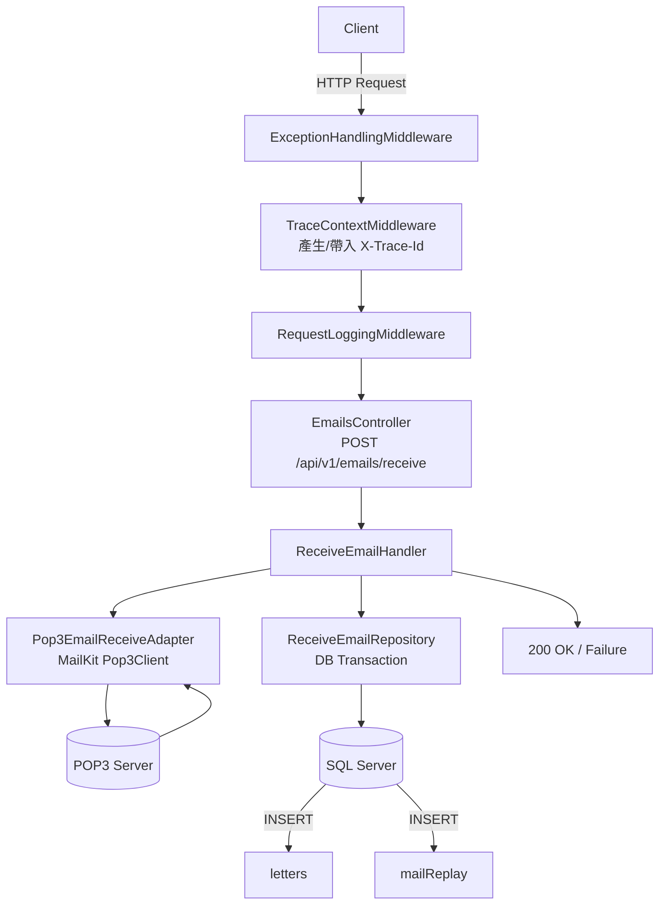

# EmailReceiver Web API

以 POP3 協定收取郵件並寫入 SQL Server 的 Web API。專案採 Clean Architecture 分層，並以 Middleware 集中處理例外、追蹤（TraceId）與日誌。

## 功能

- 透過 POP3 連線收信（MailKit）
- 將每封信寫入既有雙表：`letters`（來信主表）+ `mailReplay`（回覆管理表）
- Result Pattern + 統一 Failure 格式
- Middleware 管線：ExceptionHandling → TraceContext → RequestLogging
- Swagger（Development 環境）

## 技術棧

- .NET: `net10.0`
- MailKit: POP3 收信
- EF Core: `Microsoft.EntityFrameworkCore.SqlServer` 9.0
- 日誌: Serilog（Console + `logs/` rolling file）
- API 文件: Swashbuckle (Swagger)

## 專案結構（重點）

```
src/EmailReceiver.WebApi/
├── Program.cs
├── ServiceCollectionExtension.cs
├── Email/
│   ├── Controllers/
│   │   ├── EmailsController.cs              # POST /api/v1/emails/receive
│   │   └── WeatherForecastController.cs     # 範例端點
│   ├── ReceiveEmailHandler.cs               # 協調收信流程
│   ├── Adpaters/
│   │   ├── IEmailReceiveAdapter.cs
│   │   └── Pop3EmailReceiveAdapter.cs       # POP3 連線收信
│   ├── Repositories/
│   │   ├── IReceiveEmailRepository.cs
│   │   └── ReceiveEmailRepository.cs        # 寫入 letters + mailReplay（交易）
│   ├── Data/
│   │   ├── EmailReceiverDbContext.cs
│   │   └── Entities/
│   │       ├── Letter.cs
│   │       └── MailReplay.cs
│   └── Options/Pop3Options.cs               # appsettings.json: Pop3
├── Health/
│   └── HealthController.cs                  # GET /api/v1/_health, GET /api/v1/_health/db
└── Infrastructure/
    ├── ErrorHandling/                       # Failure / FailureCode
    ├── TraceContext/                        # TraceId (AsyncLocal)
    └── Middleware/                          # Middleware 管線
```

## 架構圖

### 1) Flowchart（請求流程）



### 2) State Diagram（客服處理狀態）

> 註：目前 API 僅負責「收信並建立初始資料」；狀態後續通常由客服流程/其他系統更新。

```mermaid
stateDiagram-v2
    state "letters.ok" as LetterOk
    [*] --> LetterOk
    LetterOk --> "2 未處理" : Create() 預設
    "2 未處理" --> "1 已處理"
    "2 未處理" --> "3 暫擱"
    "3 暫擱" --> "2 未處理"

    state "mailReplay.status" as ReplayStatus
    [*] --> ReplayStatus
    ReplayStatus --> "1 待處理" : Create() 預設
    "1 待處理" --> "2 結案"
    "1 待處理" --> "0 刪除"
    "2 結案" --> "0 刪除"
```

### 3) Sequence Diagram（收信端點）

完整循序圖請參考 [docs/receive-emails-sequence.md](docs/receive-emails-sequence.md)

## 設定

### 資料庫連線（必填）

目前資料庫連線字串由環境變數 `SYS_DATABASE_CONNECTION_STRING` 提供（`appsettings.json` 的 `ConnectionStrings:DefaultConnection` 目前未被注入使用）。

本地開發建議：使用 [env/local.env](env/local.env) 並以 `--local` 啟動（程式會自動讀取該檔案並注入環境變數）。

### POP3 設定

在 [src/EmailReceiver.WebApi/appsettings.json](src/EmailReceiver.WebApi/appsettings.json) 的 `Pop3` 區段設定：

```json
{
  "Pop3": {
    "Host": "192.168.1.110",
    "Port": 110,
    "UseSsl": false,
    "Username": "dmarc",
    "Password": "dmarc"
  }
}
```

## 資料庫結構

此專案採既有雙表結構：

- `letters`：來信主表（主鍵 `lNo`）
- `mailReplay`：回覆管理表（以 `lNo` 關聯至 `letters.lNo`）

建立表格可參考：

- [db/letters.sql](db/letters.sql)
- [db/mailReplay.sql](db/mailReplay.sql)

注意：SQL 腳本內含 `[MISC].[dbo]` schema 名稱；若你的資料庫不是使用該 schema，請依環境調整（EF Model 預設對應 `dbo`）。

## 執行

### 開發環境

#### 方式 A：使用 `--local` 載入本地環境變數（推薦）

1. 編輯 `env/local.env` 設定資料庫連線字串：
   ```ini
   SYS_DATABASE_CONNECTION_STRING=Server=localhost;Database=MISC;User Id=sa;Password=YourPassword;TrustServerCertificate=True;
   ```

2. 執行專案：
   ```bash
   dotnet run --project src/EmailReceiver.WebApi/EmailReceiver.WebApi.csproj -- --local
   ```

#### 方式 B：手動設定環境變數

PowerShell 範例：

```powershell
$env:SYS_DATABASE_CONNECTION_STRING = "Server=localhost;Database=MISC;User Id=sa;Password=YourPassword;TrustServerCertificate=True;"
dotnet run --project src/EmailReceiver.WebApi/EmailReceiver.WebApi.csproj
```

Swagger（Development）通常在 `http://localhost:{port}/swagger`。

### 生產環境部署

#### 步驟 1：發布應用程式

```bash
# Windows x64（獨立執行檔，不需安裝 .NET Runtime）
dotnet publish src/EmailReceiver.WebApi/EmailReceiver.WebApi.csproj -c Release -r win-x64 --self-contained true -o publish/win-x64

# Linux x64（獨立執行檔）
dotnet publish src/EmailReceiver.WebApi/EmailReceiver.WebApi.csproj -c Release -r linux-x64 --self-contained true -o publish/linux-x64
```

發布完成後，執行檔位於 `publish/win-x64/EmailReceiver.WebApi.exe`（Windows）或 `publish/linux-x64/EmailReceiver.WebApi`（Linux）。

#### 步驟 2：啟動應用程式

**選項 A：使用 `--local` 參數（推薦）**

1. 將 `env/local.env` 複製到執行檔所在目錄的上層 `env` 資料夾：
   ```
   publish/
   ├── win-x64/
   │   └── EmailReceiver.WebApi.exe
   └── env/
       └── local.env
   ```

2. 執行時帶入 `--local` 參數：
   ```bash
   # Windows
   .\EmailReceiver.WebApi.exe --local

   # Linux
   ./EmailReceiver.WebApi --local
   ```

**選項 B：使用 PowerShell 設定個人系統環境變數**

設定永久性的使用者環境變數（重啟後仍有效）：

```powershell
# 設定環境變數
[Environment]::SetEnvironmentVariable("SYS_DATABASE_CONNECTION_STRING", "Server=your-server;Database=MISC;User Id=sa;Password=YourPassword;TrustServerCertificate=True;", "User")

# 驗證設定
[Environment]::GetEnvironmentVariable("SYS_DATABASE_CONNECTION_STRING", "User")

# 重啟 PowerShell 後，直接執行
.\EmailReceiver.WebApi.exe
```

> **注意**：設定系統環境變數後，需要重新開啟 PowerShell 或命令提示字元視窗，新的環境變數才會生效。

**選項 C：臨時設定當前工作階段環境變數**

```powershell
# 僅在當前 PowerShell 工作階段有效
$env:SYS_DATABASE_CONNECTION_STRING = "Server=your-server;Database=MISC;User Id=sa;Password=YourPassword;TrustServerCertificate=True;"
.\EmailReceiver.WebApi.exe
```

**選項 D：建立啟動腳本**

建立 `start.bat`（Windows 批次檔）：
```batch
@echo off
set SYS_DATABASE_CONNECTION_STRING=Server=your-server;Database=MISC;User Id=sa;Password=YourPassword;TrustServerCertificate=True;
EmailReceiver.WebApi.exe
pause
```

建立 `start.ps1`（PowerShell 腳本）：
```powershell
$env:SYS_DATABASE_CONNECTION_STRING = "Server=your-server;Database=MISC;User Id=sa;Password=YourPassword;TrustServerCertificate=True;"
.\EmailReceiver.WebApi.exe
```

#### 步驟 3：驗證服務啟動

服務啟動後，可使用健康檢查端點驗證：

```bash
# 基本健康檢查
curl http://localhost:5000/api/v1/_health

# 資料庫連線檢查
curl http://localhost:5000/api/v1/_health/db
```

## API

### POST /api/v1/emails/receive

從 POP3 收取郵件並逐封寫入資料庫（`letters` + `mailReplay`）。

成功回應：

```json
{
  "savedCount": 5,
  "message": "成功接收並儲存 5 封郵件"
}
```

curl 範例（含 TraceId）：

```bash
curl -X POST "http://localhost:9527/api/v1/emails/receive" -H "X-Trace-Id: demo-trace-id"
```

> 若你的環境啟用了 HTTPS，請將 URL 改為 `https://...`。

### GET /api/v1/_health

基本健康檢查端點，回傳服務狀態。

成功回應：

```json
{
  "status": "Healthy",
  "timestamp": "2025-12-19T02:55:00.000Z"
}
```

### GET /api/v1/_health/db

資料庫連線診斷端點，檢查資料庫是否可訪問。

成功回應（資料庫連線正常）：

```json
{
  "status": "Healthy",
  "database": "Connected",
  "timestamp": "2025-12-19T02:55:00.000Z"
}
```

失敗回應（資料庫連線異常，HTTP 503）：

```json
{
  "status": "Unhealthy",
  "database": "Disconnected",
  "error": "錯誤訊息...",
  "timestamp": "2025-12-19T02:55:00.000Z"
}
```

## 追蹤與錯誤格式

- 追蹤標頭：`X-Trace-Id`
  - Client 可自帶；未提供時伺服器會產生
  - Response 一定會回傳 `X-Trace-Id`

錯誤回應格式（示意）：

```json
{
  "code": "Pop3ConnectionError",
  "message": "從 POP3 伺服器取得郵件時發生錯誤",
  "traceId": "..."
}
```

## 測試

整合測試位於 `tests/EmailReceiver.IntegrationTest/`（BDD / Reqnroll），並以 Fake Adapter 模擬 POP3 回應。

```bash
dotnet test tests/EmailReceiver.IntegrationTest/EmailReceiver.IntegrationTest.csproj
```

## 其他端點（範例/測試用）

- `GET /WeatherForecast`
- `GET /api/v1/tests`（回傳 query 參數）
- `GET /api/v1/_health`（健康檢查）
- `GET /api/v1/_health/db`（資料庫診斷）

## 常見問題

### 1) 呼叫 API 被 307 轉址到 HTTPS

若你在環境變數只設定 `ASPNETCORE_URLS=http://...`，但專案仍啟用 `UseHttpsRedirection()`，可能會出現 HTTP → HTTPS 轉址；請依你的部署方式調整 `ASPNETCORE_URLS`（同時提供 http/https）或調整反向代理/憑證設定。

### 2) 資料庫連線失敗

- 確認已設定 `SYS_DATABASE_CONNECTION_STRING`
- 確認資料庫中存在 `letters` 與 `mailReplay` 兩張表

### 3) POP3 連線失敗

- 確認 `Pop3` 設定（Host/Port/UseSsl/帳密）
- 若使用 Gmail，通常需使用 SSL 與應用程式密碼（Port 常見為 995），並依實際環境調整
