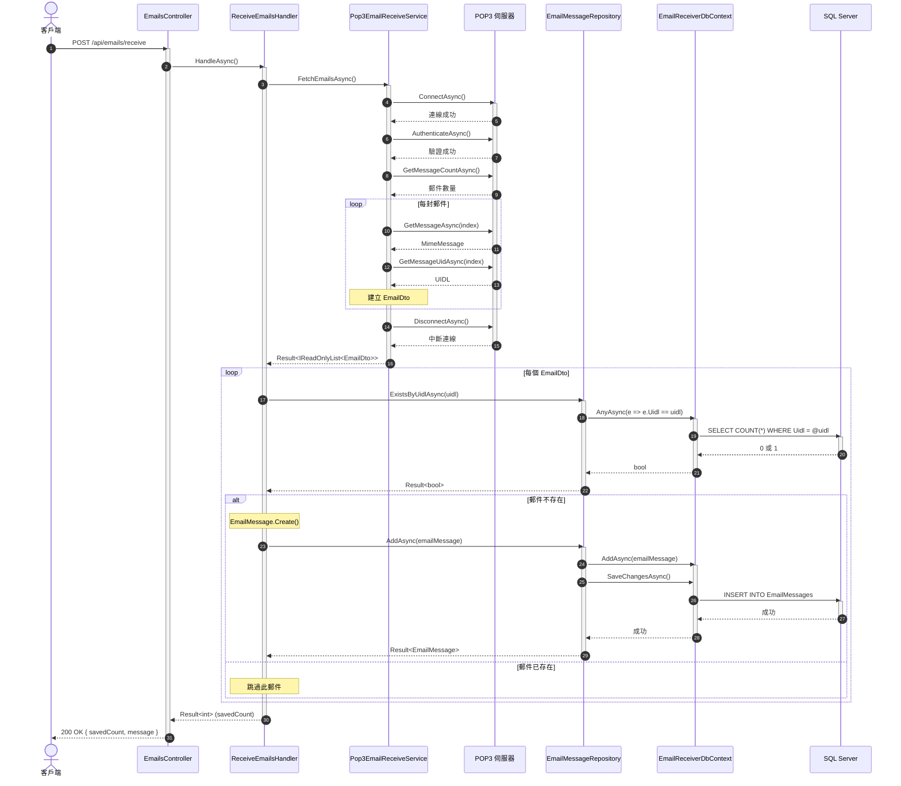
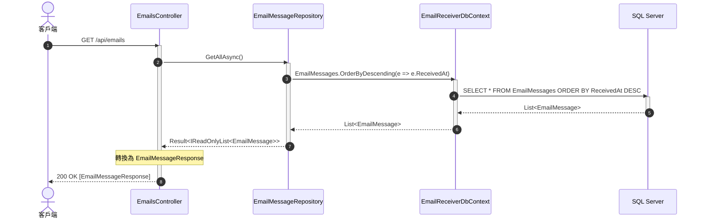

# 收信功能循序圖

## POST /api/emails/receive - 接收郵件

```mermaid
sequenceDiagram
    autonumber
    actor Client as 客戶端
    participant Controller as EmailsController
    participant Handler as ReceiveEmailsHandler
    participant Service as Pop3EmailReceiveService
    participant Pop3 as POP3 伺服器
    participant Repository as EmailMessageRepository
    participant DbContext as EmailReceiverDbContext
    participant Database as SQL Server

    Client->>Controller: POST /api/emails/receive
    activate Controller

    Controller->>Handler: HandleAsync()
    activate Handler

    Handler->>Service: FetchEmailsAsync()
    activate Service

    Service->>Pop3: ConnectAsync()
    activate Pop3
    Pop3-->>Service: 連線成功

    Service->>Pop3: AuthenticateAsync()
    Pop3-->>Service: 驗證成功

    Service->>Pop3: GetMessageCountAsync()
    Pop3-->>Service: 郵件數量

    loop 每封郵件
        Service->>Pop3: GetMessageAsync(index)
        Pop3-->>Service: MimeMessage

        Service->>Pop3: GetMessageUidAsync(index)
        Pop3-->>Service: UIDL

        Note over Service: 建立 EmailDto
    end

    Service->>Pop3: DisconnectAsync()
    Pop3-->>Service: 中斷連線
    deactivate Pop3

    Service-->>Handler: Result<IReadOnlyList<EmailDto>>
    deactivate Service

    loop 每個 EmailDto
        Handler->>Repository: ExistsByUidlAsync(uidl)
        activate Repository

        Repository->>DbContext: AnyAsync(e => e.Uidl == uidl)
        activate DbContext

        DbContext->>Database: SELECT COUNT(*) WHERE Uidl = @uidl
        activate Database
        Database-->>DbContext: 0 或 1
        deactivate Database

        DbContext-->>Repository: bool
        deactivate DbContext

        Repository-->>Handler: Result<bool>
        deactivate Repository

        alt 郵件不存在
            Note over Handler: EmailMessage.Create()

            Handler->>Repository: AddAsync(emailMessage)
            activate Repository

            Repository->>DbContext: AddAsync(emailMessage)
            activate DbContext

            Repository->>DbContext: SaveChangesAsync()

            DbContext->>Database: INSERT INTO EmailMessages
            activate Database
            Database-->>DbContext: 成功
            deactivate Database

            DbContext-->>Repository: 成功
            deactivate DbContext

            Repository-->>Handler: Result<EmailMessage>
            deactivate Repository
        else 郵件已存在
            Note over Handler: 跳過此郵件
        end
    end

    Handler-->>Controller: Result<int> (savedCount)
    deactivate Handler

    Controller-->>Client: 200 OK { savedCount, message }
    deactivate Controller
```

## GET /api/emails - 取得所有郵件

```mermaid
sequenceDiagram
    autonumber
    actor Client as 客戶端
    participant Controller as EmailsController
    participant Repository as EmailMessageRepository
    participant DbContext as EmailReceiverDbContext
    participant Database as SQL Server

    Client->>Controller: GET /api/emails
    activate Controller

    Controller->>Repository: GetAllAsync()
    activate Repository

    Repository->>DbContext: EmailMessages.OrderByDescending(e => e.ReceivedAt)
    activate DbContext

    DbContext->>Database: SELECT * FROM EmailMessages ORDER BY ReceivedAt DESC
    activate Database
    Database-->>DbContext: List<EmailMessage>
    deactivate Database

    DbContext-->>Repository: List<EmailMessage>
    deactivate DbContext

    Repository-->>Controller: Result<IReadOnlyList<EmailMessage>>
    deactivate Repository

    Note over Controller: 轉換為 EmailMessageResponse

    Controller-->>Client: 200 OK [EmailMessageResponse]
    deactivate Controller
```
